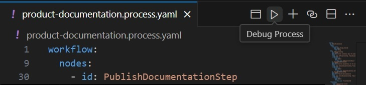

# Process Framework: Product Documentation declarative example

This project example demonstrates how to define, preview, and execute a process of generating product documentation using declarative AI Agents as process steps.

Note: it is recommended to work with this example using [Semantic Kernel Tools](https://marketplace.visualstudio.com/items?itemName=ms-semantic-kernel.semantic-kernel) VS Code extension.

## Getting Started

1. Open the [product-documentation.process.yaml](./product-documentation.process.yaml) file in VS Code to start working with processes.

## Features

### Select an AI Model

To select an AI model:
- Open the Semantic Kernel extension in the side panel of Visual Studio Code.
- In the "AI Endpoints" section, choose your preferred AI provider and model.

### Preview a Process

To preview a process:
- Open the [product-documentation.process.yaml](./product-documentation.process.yaml) file.
- Click the **Preview Process** button in the top bar of the process file.

### Debug a Process

To debug a process:
- Open the [product-documentation.process.yaml](./product-documentation.process.yaml) file.
- Click the **Debug Process** button in the top bar of the process file.

## Reporting Issues

If you encounter any issues or have suggestions, please report them on our [GitHub repository](https://github.com/microsoft/semantic-kernel).
